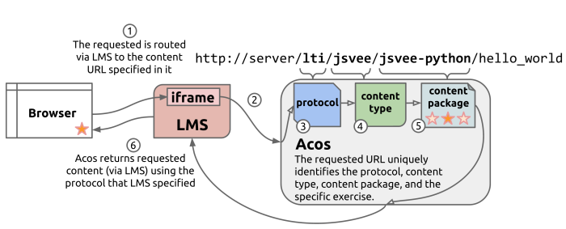

Developing Acos packages
========================

This document describes how to implement new Acos packages (protocols,
content types, content packages and tools). In addition to reading this
document, packages `acos-html`, `acos-annotated` and `acos-annotated-demo`
contain simple working examples of these packages.


## General overview

### Launching URLs



Activities are launched by using URLs that contain four different parts:

* Protocol
* Content type
* Content package
* Content name

For example: `/lti/jsvee/jsvee-python/hello_world` In this case, the
protocol is `lti`, content type is `jsvee`, content package is
`jsvee-python` and the actual activity inside the package is `hello_world`.

When an activity is launched, the request will go through these different
parts that will initialize them and produce the required HTML markup.
The launching protocol can be changed by replacing it with another protocol
in the URL. The `html` protocol is the simplest one which allows embedding
the content inside `iframe`.

### Common functions

All Acos packages must contain the `register` function which is called
when packages are loaded after the server has been started. The function
is described in more detail below but the basic idea is to register the
package to the global `handlers` object.

Protocols, content types and content packages must implement the `initialize`
function that is called when an activity is being launched. The function
injects the required HTML and JavaScript code the different parts need.

### Producing the HTML content

After the protocol, content type and content package have been initialized,
Acos sends the HTML page to the client. A simple HTML page could look like:

```html
<!DOCTYPE html>
<html>

  <head>
    <title>My Content</title>  

    <!-- Protocol -->
    <script src="/static/html/jquery.min.js" type="text/javascript"></script>
    <script src="/static/html/events.js" type="text/javascript"></script>

    <!-- Content type -->
    <script src="/static/mycontenttype/library.js" type="text/javascript"></script>
    <link href="/static/mycontenttype/style.css" rel="stylesheet">

    <!-- Content package -->
    <script src="/static/mycontentpackage/content.js" type="text/javascript"></script>

  </head>

  <body>

    <!-- Content package -->
    <div class="content-div" data-id="my-example"></div>

  </body>

</html>
```
In this example, the content type finds the `div` element and replaces it with
the actual content. The parts that the three parts have added, are marked with
comments.

During the execution of the `initialize` function, those lines are added to
`params.headContent` and `params.bodyContent`. See below for more details.

### Serving static files

For each installed package, the directory `static` inside the package
is automatically served. The files are in the URL `/static/package/file.xyz`
where `package` is the namespace of the package and `file.xyz` a file inside
the `static` directory.

All the public files that are needed (for example JS and CSS) should be placed
there.

### Metadata

All Acos packages must export `meta` variable that contains information
about the package. More details are in the examples below. The following
variables can be used: `name`, `title`, `description`, `author`, `license`,
`version`, `created`, `modified`, `keywords` and `concepts`.


## Creating a new protocol

The following functions and variables must be available: `initialize`, `handleEvent`,
and `register`. See below for details.

### `initialize`

```javascript
var initialize = function(req, params, handlers, cb) {

  // Initialize the protocol
  params.headContent += ...
  params.bodyContent += ...

  // Initialize the content type (and content package)
  handlers.contentTypes[req.params.contentType].initialize(req, params, handlers, function() {
    cb();
  });

};
```

The purpose of this function is to initialize an activity after a launching
request has been received. In the `req.params` object the following values
are available: `protocol`, `contentType`, `contentPackage` and `name`.

The actual name of the activity should be taken from `params.name`.

In the launching sequence, protocol handles the request first. It should
add the protocol-specific HTML markup to `params.headContent` and `params.bodyContent`
by concatenating the markup with the existing strings.

After the protocol initialization is ready, protocol must initialize the
content package in order to continue the launch. The initialization call
contains parameters `req`, `params`, `handlers` and a callback function that
finally calls the given `cb` function. Before the `cb` function is called,
protocol is able to do some initialization tasks after content type and content
have been initialized if needed.

If the initialization fails, `params.error` should contain an error message to
indicate that an error occurred.


### `handleEvent`

```javascript
var handleEvent = function(event, payload, req, res, protocolData) {
  res.json({ 'status': 'OK' });
};
```

This function receives events from the client browser. When an event
occurs, it is first processed by the content package and content type.
Protocol is the last recipient and is responsible for sending the response
back to the client.

It is up to the protocol how to process the data. The event may be logged,
sent to another server etc...

The parameter `event` contains the name of the occurred event, `payload`
contains the actual event data sent by the activity and `protocolData`
contains the protocol-specific information such as user id or other required
data.


### `register`

```javascript
var register = function(handlers, app, config) {
  handlers.protocols.proto = protocolObject;
};
```

This function is called when Acos server starts and installs all the available
packages. The main functionality of this registration is to add the protocol
object containing all the required functions to the global `handler` object.
In the example above, `proto` is the namespace of the protocol (see more below)
and `protocolObject` is the object containing the required functions.

Express instance is available in the variable `app` and the Acos configuration
file as object in `config`.


### Other definitions

```javascript
var namespace = 'html';
var packageType = 'protocol';
```

The protocol must export variables `namespace` and `packageType`.

The variable `namespace` contains the namespace for the protocol. It is used,
for example, in the URL when activities are launched. The protocol object can
also be retrieved from the `handlers` object by using the namespace.

The variable `packageType` must be `protocol`.

```javascript
var meta = {
  'name': 'html',
  'shortDescription': '',
  'description': '',
  'author': '',
  'license': '',
  'version': '0.0.1',
  'url': ''
};
```

Also the metadata as shown in above must be exported as variable `meta`. The
variable `name` is the namespace for the protocol.


### Browser library for sending events

Protocol must also implement the client-side library for sending events.
The file is called `events.js` and it must be in `static` directory inside
the protocol package.

The main purpose is that the library provides the `sendEvent` function in the
global `ACOS` namespace. When content wants to send data to the server, it uses
that function by specifying the event name `event` and provides the data that
should be sent. The protocol can send any additional data that is required in
the server-side. When an activity is initialized, the server-side code can
inject hidden HTML fields or some JavaScript to maintain the required
protocol-specific data in the user's browser.

Below is an example implementation:

```javascript
(function($) {
  'use strict';

  var ACOS = function() {};

  ACOS.sendEvent = function(event, payload) {

    var protocolData = { /* some data */ };

    var data = {
      'event': event,
      'payload': JSON.stringify(payload),
      'protocolData': JSON.stringify(protocolData)
    };

    var target = window.location.pathname;
    if (target[target.length - 1] == '/') {
      target = target.substring(0, target.length - 1);
    }

    if (event === 'log' && window.AcosLogging && AcosLogging.noLogging) {
      // Sending log events is forbidden
      return;
    } else {
      $.post(target + "/event", data);
    }

  };

  // Make the namespace globally available
  window.ACOS = ACOS;

}(jQuery));
```

The function must always be available in `ACOS.sendEvent` as the content does
not know which protocol is in use.

It is important that the `noLogging` variable is checked in order to prevent
sending any logging events to the server if the activity is launched in mode
where logging is not allowed.


## Creating a new content type

The following functions and variables must be available: `initialize`, `handleEvent`, `register`,
`namespace`, `packageType`, `installedContentPackages`, `meta`. See below for details.

### `initialize`

```javascript
var initialize = function(req, params, handlers, cb) {

  // Initialize the content type
  params.headContent += ...
  params.bodyContent += ...

  // Initialize the content package
  handlers.contentPackages[req.params.contentPackage].initialize(req, params, handlers, function() {    
      cb();
    }
  });
};
```
The purpose of this function is to initialize the content package after a
launching request has been received. The protocol has already been initialized
before this function is called.

Content type should add the HTML markup required by the content type
to `params.headContent` and `params.bodyContent` by concatenating the markup with
the existing strings.

In the `req.params` object the following values
are available: `protocol`, `contentType`, `contentPackage` and `name`.
The actual name of the activity should be taken from `params.name`.

After the content type initialization is ready, the content package must be
initialized in order to continue the launch. The initialization call contains
parameters `req`, `params`, `handlers` and a callback function that finally calls
the given `cb` function. Before the `cb` function is called, content type is able
to do some initialization tasks after the content package have been initialized
if needed.

If the initialization fails, `params.error` should contain an error message to
indicate that an error occurred.


### `handleEvent`
```javascript
var handleEvent = function(event, payload, req, res, protocolPayload) {

};
```

This function receives events from the client browser. It is up to the content
type how to process the data. The event may be logged, sent to another server etc...
Or the event can just be ignored if there is no need to process it.

The parameter `event` contains the name of the occurred event, `payload`
contains the actual event data sent by the activity and `protocolData` contains
the protocol-specific information such as user id or other required data.

As the protocol communicates with the browser, content type should not send any data
although the variable `res` is available.


### `register`
```javascript
var register = function(handlers, app, config) {
  handlers.contentTypes.newtype = newTypeObject;
};
```
This function is called when Acos server starts and installs all the available
packages. The main functionality of this registration is to add the content type
object containing all the required functions to the global `handler` object.
In the example above, `newtype` is the namespace of the content type (see more below)
and `newTypeObject` is the object containing the required functions.

Express instance is available in the variable `app` and the Acos configuration
file as object in `config`.


### Other definitions
```javascript
var namespace = 'newtype';
var installedContentPackages = [];
var packageType = 'content-type';
```

The content type must export variables `namespace`, `installedContentPackages` and
`packageType`.

The variable `namespace` contains the namespace for the content type. It is used,
for example, in the URL when activities are launched. The content type object can
also be retrieved from the `handlers` object by using the namespace.

The variable `packageType` must be `content-type`.

```javascript
var meta = {
  'name': 'newtype',
  'shortDescription': 'A new content type',
  'description': '',
  'author': '',
  'license': '',
  'version': '0.0.1',
  'keywords': ['content', 'type'],
  'url': ''
};
```
Also the metadata as shown in above must be exported as variable `meta`. The
variable `name` is the namespace for the content type.


## Creating a new content package

The following functions and variables must be available: `initialize`, `handleEvent`,
`register`, `namespace`, `contentTypeNamespace`, `packageType`, `meta`. See below for details.

### `initialize`

```javascript
var initialize = function(req, params, handlers, cb) {

  // Initialize the content package
  params.headContent += ...
  params.bodyContent += ...

  cb();

};
```

The purpose of this function is to initialize the actual content after a launching
request has been received. The protocol and content package have already been
initialized before this function is called.

Content should add the HTML markup required by the content to `params.headContent`
and `params.bodyContent` by concatenating the markup with the existing strings.

In the `req.params` object the following values
are available: `protocol`, `contentType`, `contentPackage` and `name`.
The actual name of the activity should be taken from `params.name`.

After the content initialization is ready, the callback `cb` must be called. If the
initialization fails, `params.error` should contain an error message to
indicate that an error occurred.


### `register`

```javascript
var.register = function(handlers, app, config) {
  handlers.contentPackages['contenttype'] = contentObject;
  handlers.contentTypes.contenttype.installedContentPackages.push(contentObject);
};
```
This function is called when Acos server starts and installs all the available
packages. The main functionality of this registration is to register the content
to the global `handler` object and add the content to the content type by using
its namespace.

In the example above, `contenttype` is the namespace of the content type and
`contentObject` is the content object that contains all the required functions.

Express instance is available in the variable `app` and the Acos configuration
file as object in `config`.


### Other definitions
```javascript
var namespace = 'newtype';
var contentTypeNamespace = 'content-type';
var packageType = 'content';
```

Content package must export the variables above. The variable `namespace`
must be the namespace of the package, `contentTypeNamespace` is the
namespace of the content type where this package belongs and `packageType`
is always `content`.

Also the following metadata must be exported:

```javascript
var meta = {
  'name': 'newtype',
  'shortDescription': '',
  'description': '',
  'author': '',
  'license': 'MIT',
  'version': '0.0.1',
  'url': '',
  'teaserContent': ['content_1'],
  'contents': {
    'content_1': {
      'description': 'First example',
      'order': 0,
      'keywords': ['first', 'example'],
      'title': 'Content 1'
    },
    'content_2': {
      'description': 'Second example',
      'order': 1,
      'keywords': ['second', 'example'],
      'title': 'Content 2'
    }
  }
};
```

The array `teaserContent` defines the preview of the package in the
front page of the server.


## Creating a new tool

The following functions and variables must be available: `register`, `namespace`, `packageType`, `meta`. See below for details.

### `register`

```javascript
var register = function(handlers, app, config) {

  handlers.tools['newtool'] = toolObject;

  app.get('/newtool', function(req, res) {

  });

};
```

This function registers the tool to the global `handlers` object. In the
example above, `newtool` is the namespace of the package and `toolObject`
is an object containing the required functions.

A tool can register own URLs and the `register` function is the easiest
place to define them via the `app` variable.


### Other definitions

```javascript
var namespace = 'newtool';
var packageType = 'tool';
```

The tool must export its namespace (`newtool` in the example above) and
set its package type to `tool`.

Also the following metadata must be exported:

```javascript
var meta = {
  'name': 'newtool',
  'shortDescription': '',
  'description': '',
  'author': '',
  'license': '',
  'version': '0.0.1',
  'url': ''
};
```


## Events

Events provide a mechanism how content can send data back to the server. This can
be any data to be logged, grading event or any other event that content wishes
implement.

### Raising events

In the client-side, content can use the following function to send events to the server:

```javascript
ACOS.sendEvent = function(event, payload) {

}
```

The protocol defines the actual implementation of the function but that function
should always be available. The parameter `event` is the name of the event and
`payload` is typically an object containing the actual data.

When an event is received, Acos forwards the event to the protocol and content type
which can then handle the event in the function `handleEvent`.


### Event types

Although content types and content can send any events, there are a few special events:

#### `grade`

Grading event should contain the following object:

```javascript
{
  points: 1,
  max_points: 1
}
```

The object can also contain `feedback` having a textual feedback.

#### `log`

This event can contain any data that should be logged and saved to server's
logging store.
